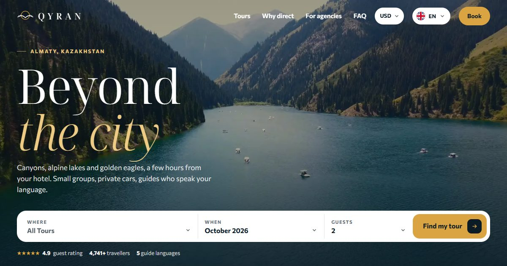

# QYRAN: tour booking site



**Live:** https://qyran-demo.pages.dev

Demo site for a fictional tour operator in Almaty, Kazakhstan, built mobile first for tourists who book a day trip from their phone. Prices, ratings and contacts are illustrative; no real payment is taken.

## Features

- Six languages with their own URLs, including Arabic laid out right to left and Hindi
- Prices in six currencies; each language defaults to its visitors' currency and the choice is remembered
- Booking flow: calendar with seat availability, group or private car, travellers, pickup, extras, contact details, 20% deposit, then a ticket with QR code, calendar file and WhatsApp confirmation
- Trip finder, 9:16 video "stories" for each tour, photo galleries of the real places (free-licence stock footage)
- Custom dropdowns, flag language switcher, line-drawn logo that draws itself in the preloader
- Mobile first: sticky bottom bar, bottom-sheet booking, 44 px tap targets, correct keyboards on forms

## Stack

Astro · TypeScript · Tailwind CSS · GSAP · Lenis · Cloudflare Pages

Every page passes an automated layout audit (Puppeteer) at five screen widths and in every language before deploy.

## Run

```bash
npm install
npm run dev
npm run build
```

Made by [Sabir Hussein](https://sabr-studio.pages.dev).
